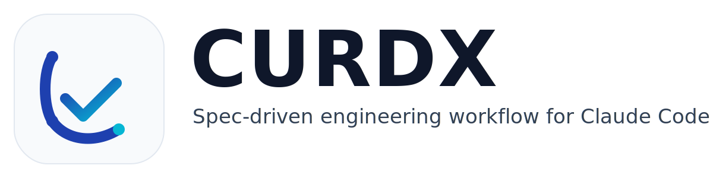

<div align="center">



# CURDX

**Spec-driven engineering workflow plugin for Claude Code**

[English](./README.md) | [简体中文](./README.zh-CN.md)

[](./LICENSE)
[](https://code.claude.com/docs/en/plugins)
[](./.github/workflows/quality-gates.yml)
[](./.github/workflows/security-scan.yml)

`research -> requirements -> design -> tasks -> implement`

</div>

---

## Why CURDX

CURDX is designed for teams that want Claude Code outputs to be:

- consistent: one shared spec workflow instead of ad-hoc prompting
- auditable: state files, progress files, and reproducible command flow
- safer: hook guardrails for tool routing, security reminders, and loop control
- extensible: commands + agents + skills in one plugin repository

## Quick Start

### 1) Install and load plugin

```bash
git clone https://github.com/ForeverWorld/curdx-ralph.git
cd curdx-ralph
claude --plugin-dir /absolute/path/to/curdx-ralph
```

### 2) Start a spec

```text
/curdx:start my-feature your goal description
```

### 3) Run full path

```text
/curdx:requirements
/curdx:design
/curdx:tasks
/curdx:implement
```

## What You Get

### Spec Workflow

- smart start/resume/switch across specs
- execution loop with progress tracking
- epic triage for large initiatives

### Hook Guardrails

- `SessionStart`: context bootstrap + TDD guard
- `PreToolUse`: security reminder + tool redirect + quick-mode guard
- `PostToolUse`: file checks + context monitor
- `Stop`/`PreCompact`: loop continuity and state persistence

### Commands

- spec lifecycle commands (`/curdx:start`, `/curdx:tasks`, `/curdx:implement`, ...)
- delivery commands (`/curdx:commit`, `/curdx:commit-push-pr`, `/curdx:review-pr`)
- hookify commands (`/curdx:hookify`, `/curdx:hookify-configure`, ...)

For the full command list and arguments, see [commands/help.md](./commands/help.md).

### Skills

`skills/` includes reusable packs across backend/frontend/engineering topics.

For China-focused projects, `cn-java-frontend-architecture` provides:
- Java + frontend architecture selection matrix
- Docker deployment blueprints and caching/mirror guidance
- optional Xinchuang readiness checklist (only when required)

## Relay Overload Auto-Retry

When relay/provider errors occur (for example `relay: 当前模型负载过高，请稍后重试`):

```bash
bash scripts/claude-auto-retry.sh --stop-on-success
```

Useful examples:

```bash
# presets
bash scripts/claude-auto-retry.sh --preset relay-common --preset cn-relay-common

# custom retriable errors
bash scripts/claude-auto-retry.sh --extra-transient "upstream timeout|provider overloaded"

# custom non-retriable errors
bash scripts/claude-auto-retry.sh --extra-non-retriable "insufficient quota|account suspended"
```

`claude-auto-retry.sh` fails fast for non-retriable errors (for example: `账户余额不足`, `insufficient balance`, `401/403/402`), so it will stop instead of looping.

## Repository Layout

```text
curdx/
├── .claude-plugin/          # plugin metadata
├── commands/                # slash commands
├── agents/                  # sub-agent prompts
├── hooks/                   # hook wiring + scripts
├── scripts/                 # CI + retry tooling
├── skills/                  # reusable skill packs
├── references/              # workflow references
├── templates/               # phase templates
├── schemas/                 # structured schemas
└── assets/logo/             # README logo assets
```

## Quality Gates

### CI workflows

- [`.github/workflows/quality-gates.yml`](./.github/workflows/quality-gates.yml)
  - shell/python syntax
  - plugin contract checks
  - policy checks
  - hook behavior tests (real subprocess execution, no mocks)
- [`.github/workflows/security-scan.yml`](./.github/workflows/security-scan.yml)
  - Trivy vulnerability + secret scanning (`CRITICAL,HIGH`)

### Local validation

```bash
bash -n hooks/scripts/*.sh scripts/*.sh
python3 -m py_compile hooks/scripts/*.py hooks/scripts/_checkers/*.py scripts/ci/*.py tests/hooks/*.py
python3 scripts/ci/check_plugin_manifest.py
python3 scripts/ci/check_claude_plugin_contract.py
python3 scripts/ci/check_skills_frontmatter.py
python3 scripts/ci/check_local_links.py
python3 scripts/ci/check_forbidden_files.py
python3 scripts/ci/check_workflow_hardening.py
python3 -m unittest discover -s tests/hooks -p 'test_*.py'
claude plugin validate .
```

## FAQ

### `/curdx:start` stopped unexpectedly

Run `/curdx:status`. CURDX may be waiting for a phase confirmation or approval gate.

### Task loop keeps failing

Run `/curdx:cancel` to clear state, then resume with `/curdx:start` or `/curdx:implement`.

### Hooks feel strict during exploration

Tune via environment variables first; avoid deleting hooks directly.

## Contributing

See [CONTRIBUTING.md](./CONTRIBUTING.md) for contribution and validation requirements.

## License

MIT, see [LICENSE](./LICENSE).
